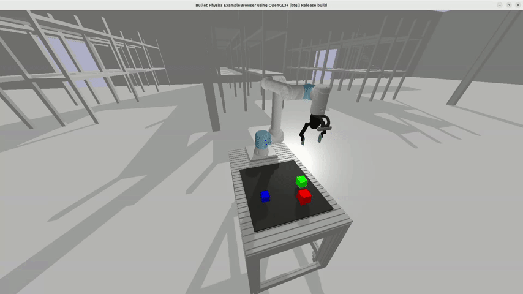

# Imitation Learning Robot: Stacking by Size

This project focuses on training a model using imitation learning to control a robotic arm in a PyBullet environment. The imitation learning started as a behavior cloning model, with plans to improve it by introducing DAgger in the mix. The goal is to stack objects of varying sizes and colors in descending order, starting with the largest.

---
## Quick Start

### Environment Setup

#### Requirements:
- Docker (including post-installation steps)
- TensorFlow (for training and running the model)
- NVIDIA GPU (recommended for training acceleration)

#### GPU Considerations:
- The default setup supports NVIDIA GPUs.
- If you do **not** have an NVIDIA GPU, modify `build_image.sh`:
  - Set the `render` argument to `base`.
  - Remove the `--gpus all` flag from the `docker run` command in `run_container.sh`.

#### Build and Run the Container:
```bash
./build_image.sh
./run_container.sh
```

## Running a Pre-trained Model

Once inside the container, navigate to the `src` folder:

- Run `demo_orientation.py` to test a model trained to stack objects using **both** the position and the orientation of the end-effector and the objects.
- Run `demo_pos.py` to test a model trained to stack objects using **only** the position values.



---
## Project Overview

The repository consists of multiple folders covering different stages of training a model that enables a robotic arm to stack objects correctly. 

The project follows these steps:
1. **Generate Demonstrations** – Collect expert demonstrations of correct stacking actions, introducing variations and noise for dataset diversity.
2. **Train a Model** – Use behavior cloning with supervised learning.
3. **Evaluate Performance** – Run trained models in simulation and collect success/failure metrics.
4. **Explore DAgger** – Test Dataset Aggregation (DAgger) to refine model performance, though initial trials worsened results.

## Training Your Own Model

### 1. Generate Demonstrations
The `src/dataset_creation` folder contains scripts to create diverse training datasets. The scripts save a file, per action taken. The stacking process of a cube follows six discrete actions:
1. `move_to_pre_grasp`
2. `move_to_grasp`
3. `lift_cube`
4. `move_to_stack_position`
5. `stack_cube`
6. `above_stack`
7. `return_home`

There are multiple files to create dataset with different characteristics:
- `create_dataset_pos.py` – Generates demonstrations with random cube placements.
- `pos_ori_noise_dataset_pos_ori.py` – Introduces noise in the end-effector's position and orientation.

### 2. Prepare the Dataset
Run `combine_json.py` to structure the dataset. It appends the next environment state as the expected action for training. This is necessary, since the next state of every action, is the desired action, which is later used as the label/ground truth to train the model with supervised learning.

### 3. Train the Model
Move the dataset to the `training` folder and use the appropriate script:
- `train_model_pos.py` – Trains a model considering only position.
- `train_model_ori.py` – Trains a model considering both position and orientation.

This generates a `.keras` file containing the trained model and its corresponding scalers.

## Model Evaluation
The `evaluation` folder contains scripts to test model performance by running 100 stacking trials and saving the results in a CSV file. Use the plotting scripts in `src/evaluation` to visualize results.

## DAgger Training
To use **DAgger**, a pre-trained base model is required. The DAgger process runs a simulation where the model continuously stacks cubes, using the expert actions when its predictions deviate significantly. The dataset grows iteratively, retraining the model every few iterations. The DAgger implementation is in `src/DAgger`.

---

